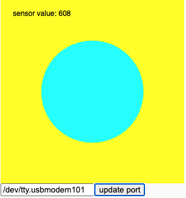

# p5.serialserver

## About

p5.serialserver is a [p5.js](https://p5js.org/) library that enables communication between your p5.js sketch and a serial enabled device, for example, an Arduino microcontroller.

This is a fork of the p5.serialserver code!
It has been ported to work with a modern versions (as of Feb 2026) of the libraries:
- node (v25)
- serialport (v12)

This version of p5.serialserver can be installed on any computer that supports Node
and Arduino.

To see the original repository, please visit [https://github.com/p5-serial/p5.serial.github.io/](https://github.com/p5-serial/p5.serial.github.io/).

## Getting Started

### Follow these steps:

1. Clone or download this repository
2. Setup Node
3. Setup Arduino Sketch
4. Connect an Arduino microcontroller (or similar serial device) to your computer
5. Setup P5 Sketch

### Node

1. Open the terminal and navigate to this repository.
2. Install the dependencies with the command `npm install`.
3. If no errors, then start the server with the command `node startserver.js`.
4. This should stay running until you are finished (then just type control/C to quit)

### Arduino Sketch

1. Pick a sketch from inside the __arduino__ directory and add it to your Arduino sketches.

### P5 Sketch

1. Copy the files from the __p5__ directory to the P5 editor [editor.p5js.org](https://editor.p5js.org/)
  (set up an account on editor.p5js.org if you don't already have one).
2. You may need to edit the sketch after running it once and noticing the list of serial ports it finds.
3. Edit the line of the P5 sketch that specifies the serial port (serialPortName).
4. Run the sketch again. Select the button "update port" to connect to the p5.serialserver.
5. Try adjusting the analog sensor on the Arduino. It should update the circle in the center of the window.

## Contributions
My contribution is small. I merely ported this to a more modern version of SerialPort (v12).
Included are a simple P5JS sketch plus an Arduino sketch to demonstrate the capability.
In the demonstration code, analog values (0 to 1023) from the Arduino are passed to the node server
running on the computer, where they are accessible by the P5 sketch running in the browser.

